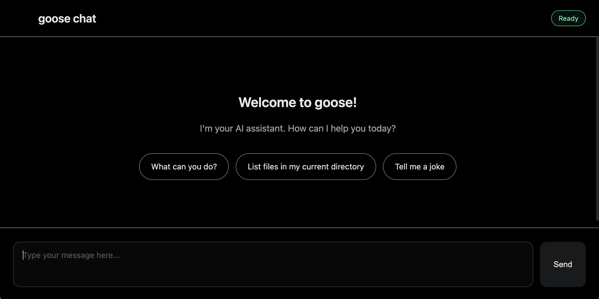

# AI SDK Provider for Goose CLI



An [AI SDK](https://sdk.vercel.ai) provider for the [Goose CLI](https://github.com/block/goose).

## Installation

```bash
npm install ai-sdk-provider-goose
```

## Usage

```typescript
import { goose } from "ai-sdk-provider-goose";
import { generateText } from "ai";

const result = await generateText({
  model: goose("goose"),
  prompt: "What is 2+2?",
});

console.log(result.text);
```

## Configuration

```typescript
const model = goose("goose", {
  binPath: "/path/to/goose", // Default: 'goose'
  timeout: 120000, // Default: 120s
  sessionName: "my-session", // Optional session name
  resume: true, // Resume previous session
  provider: "anthropic", // Set custom provider
  model: "claude-haiku-4-5", // Set specific model
});
```

## License

MIT
